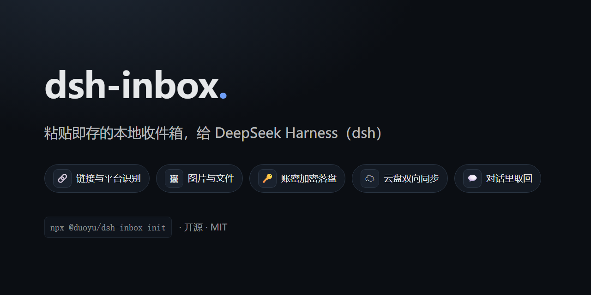
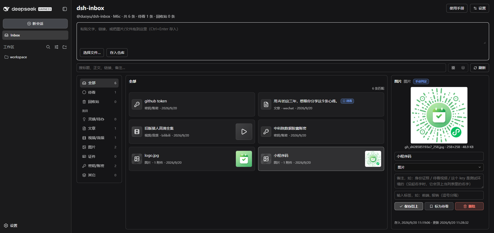

# dsh-inbox



A **local inbox plugin for [DeepSeek Harness](https://github.com/deepseek-ai/deepseek-harness)** (`dsh`): file whatever you copy into one vault, get it back when you need it — including **by asking your assistant in conversation**.

English | [中文](README.zh.md)

## The problem it solves

The things you copy during a day — a link to read later, a screenshot, a snippet of config, an account and password — end up scattered across clipboard history, bookmark folders and temporary files. When you need them you cannot find them, and you cannot remember where they went.

**dsh-inbox puts them in one local vault**: paste to file, automatic classification, browse and search from the sidebar — and instead of digging through it yourself, just ask your assistant "what was that article about caching I saved last month?".

It works for you alone: everything lands on your machine, and the model only sees a record when you ask it to look.

## Features

| Feature | What it does |
|---|---|
| **Two ways in** | `/inbox <text or link>` in the composer (attach images to carry them along), or paste / drop / pick a file in the panel |
| **Automatic classification** | Links are filed by platform and media type (a Bilibili video, a WeChat article…), text by credential shape, images get a 疑似证件 tag when they have card proportions; what the rules cannot decide goes to the model, with a daily cap |
| **Panel** | Filter by watch-later / category / tag, search across title, text, link and note, switch between two list densities; the detail pane edits name, category, note and tags, flags watch-later, deletes and restores; it follows dsh's dark and light themes |
| **Everything has a name** | A link is named by the headline of the page it points at (no model tokens spent), a photo or file by the name it arrived with, and the name you type always wins. The row shows the name; the glyph on the left says what kind of thing it is (a key for a credential) |
| **Who judged the category** | A coloured badge next to the category: 规则判定 (grey, the local rules) / 模型判定 (violet, the capped model pass) / 手动判定 (blue, your own choice — nothing overwrites it later) |
| **Ask in conversation** | Ask for 收件箱 / 仓库 / inbox and the assistant searches by words, category, tag, watch-later flag or kind (ten at a time plus a count of the rest, with thumbnails right in the results), then opens one by id (text up to 1000 characters, link, note, tags, attachment facts). 打开 next to a result jumps to that record in the right-hand dock |
| **Looking at a picture** | Image bytes stay out of the conversation by default; when you ask "look at this picture and tell me what it is", the assistant sends that one image to itself — explicitly, per call |
| **Credentials are safe** | A credential's body is **encrypted at rest** with a key derived from your master password; neither the password nor the key is ever written down. The list shows only the name you gave it; plain text never reaches a conversation or a model |
| **Two-way sync** | Point it at a WebDAV folder or an S3 bucket: changes are pushed a few seconds after you make them, 刷新 runs a full sync (push, then pull, settled by timestamp), and emptying the recycle bin deletes the cloud copies too |
| **Conversation cards** | Tool results render as dsh-inbox cards — links become clickable, image markers become thumbnails drawn on your machine |
| **Gateway quirks** | Some object-storage gateways bind each AccessKey to an "application" and identify clients by a header (refusing you with the same status a wrong password gets) — the plugin keeps **one client identity per protocol** for exactly that |

## Screenshots



It all lives inside dsh: the left rail gains an **Inbox** entry that opens a full-page vault, and the panel's top right has 设置 (settings) and 使用手册 (a short manual).

## Two ways to use it

**① File something from the conversation**

Type `/inbox` in the composer followed by text or a link, and attach images directly — **this command never reaches the model**, it only goes into the vault. It is the way to file credentials and throwaway links that have no business appearing in a conversation.

**② Ask for it later**

No command needed, just talk:

> which of my saved images is the mini-program code?
>
> show me that article about caching I saved last week
>
> list the links in my inbox I haven't read yet

The assistant searches the vault and the answer comes back as a card: links are clickable, images are rendered as thumbnails **on your machine** (image bytes never enter the model's context — the model only sees that a picture is there; click a thumbnail to see it full size).

<!--
  For a conversation screenshot: drop the file at docs/assets/chat.png and uncomment.


-->

## Install

Requires Node ≥ 22 and a working `dsh` (`@deepseek-ai/dsh`).

**Platform**: fully accepted on **Windows** only so far; macOS and Linux are **not verified yet** (no platform-specific dependency in the code — try it and tell me how it goes).

One command installs it:

```powershell
npx @duoyu/dsh-inbox init
```

It does three things, and running it twice is safe:

1. installs the plugin into a profile (`inbox` by default; if that profile does not exist it tells you how to create one)
2. copies dsh's shipped `standard` preset into `~/.dsh/.agent-presets/inbox/` and adds this plugin — **this is the step that decides whether the assistant can see the inbox tools**
3. points the user-level default preset at it (backing up `~/.dsh/settings.yaml` first)

Then restart dsh and open a new session:

```powershell
dsh --profile inbox --no-open --port 3102
```

Open the printed URL (it carries a token). The Inbox panel is in the left rail; in a new session, ask "what links in my inbox haven't I read yet?" and the assistant will look it up. **Your daily `dsh web` profile is not touched.**

Useful flags:

```powershell
npx @duoyu/dsh-inbox init                      # into the inbox profile (default)
npx @duoyu/dsh-inbox init --profile web        # into the profile you already use
npx @duoyu/dsh-inbox init --no-default         # install only, leave the default preset alone
npx @duoyu/dsh-inbox init --help               # every flag
```

Which profile you install into only decides **where the panel runs**. The agent preset is shared by every profile (`~/.dsh/.agent-presets/inbox/`), so installing into a second profile just fills in the missing row.

### From a local checkout

```powershell
git clone <this repo> dsh-inbox ; cd dsh-inbox
pnpm install ; pnpm build
node lib/cli.js init --package <absolute path to this repo>
```

### Uninstall

```powershell
# 1. remove the package from the profile (also drops it from dsh.profile.bundles)
dsh plugin --profile inbox remove @duoyu/dsh-inbox

# 2. delete what init created
rm -r ~/.dsh/.agent-presets/inbox      # the preset copy
# default preset: delete agent-presets.default in ~/.dsh/settings.yaml (falls back to the
# deployment default) or set it to standard; every init left a settings.yaml.bak-* backup

# 3. and the isolated profile, if you want it gone
rm -r ~/.dsh/profiles/inbox
```

**Uninstalling does not delete your vault.** To remove the records too: `rm -r ~/.dsh/storages/dsh_inbox`.

## Where things live

All of it on your machine (`%DSH_HOME%`, i.e. `C:\Users\<you>\.dsh` on Windows):

| What | Where |
|---|---|
| Records: text, links, category, note, tags, watch-later… | `storages\dsh_inbox\items\*.json`, one file each |
| Attachment index (mime / size / original name) | `storages\dsh_inbox\attachments\*.json` |
| The **bytes** of images, videos and files | `attachments\` — dsh's own content-addressed store, never auto-deleted |
| Remote password / S3 AccessKey Secret | dsh's credential store, `.credentials.yaml` |
| Remote settings (URL, bucket, client identity…) | dsh's own settings |

### What the remote looks like

With a remote configured and `/inbox` as the directory:

| Remote path | What it is |
|---|---|
| `inbox/<whatever you drop>` | The **drop folder**: any device drops files here and this one ingests them |
| `inbox/sync/items/<record id>.json` | One record, **machine-readable** — the source of truth for sync |
| `inbox/sync/items/<record id>.txt` | The same record, **readable** (text, note, which attachments it points at) |
| `inbox/sync/attachments/<attachment id>.<ext>` | Attachment **bytes** (images, video, PDFs open as themselves) |
| `inbox/sync/attachments/<attachment id>.meta.json` | The attachment's metadata (original name, dimensions, size, digest) |
| A 0-byte key ending in `/` | A folder marker the cloud drive made itself, not us |

## Privacy and security

- **Credentials are encrypted at rest**: the body is stored as ciphertext (AES-256-GCM, key derived from your master password). **Neither the password nor the key is ever written down** — the vault locks again on every restart and you unlock it under 设置 → 账密加密; a forgotten password means unrecoverable ciphertext. With no master password set, a credential is **refused rather than stored in the clear**.
- **What that covers**: only the **body** of credential records. Notes, categories, tags, timestamps and attachment **bytes** are not encrypted — a key inside a pasted file is still a key inside a file.
- **Masked where it matters**: a credential is listed by the name you gave it, and its plain text never reaches a conversation or a model.
- **Pictures**: classification does send an image to the model (a phone photo of an ID card has the same proportions as any other photo); the conversation gets an `[attachment:id]` marker by default. **The one exception**: when you explicitly ask the assistant to look at a picture, that single image is sent to it — per call, never by default.
- **The model cannot see your vault** unless you ask it to look, and classification requests are redacted first.
- **Your remote needs access control**: only credential bodies are ciphertext up there — text, links, notes and attachment bytes are in the clear, and the master password and key never sync.

## Development

```powershell
pnpm install
pnpm build        # lib/index.js (host) + lib/client.js (panel) + lib/cli.js (init) + lib/types
pnpm typecheck
pnpm test         # vitest
```

Client-side changes need `pnpm build` and a page reload (dsh's client-hmr reloads it for you); host-side changes need a restart. Details in [docs/help/dev-setup.md](docs/help/dev-setup.md); milestones and acceptance records in the [development bus](docs/feature/dev-bus.md).

## License

MIT
